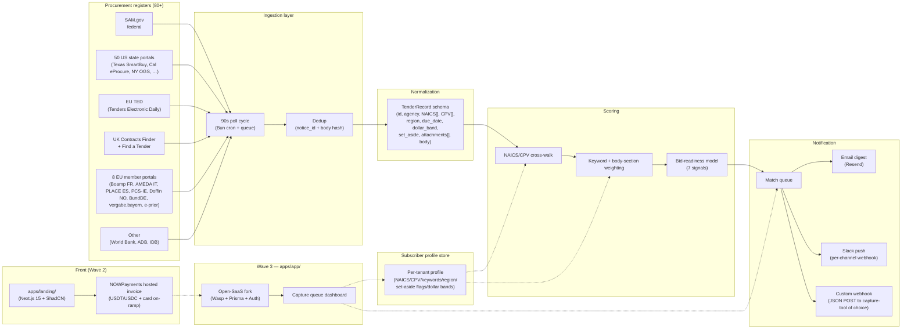
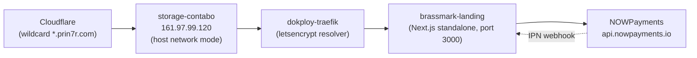

# 02 — Architecture

## System overview

Brassmark is a four-stage pipeline behind a thin SaaS front-end:

1. **Ingestion** — pulls 80+ public procurement registers on a 90-second poll.
2. **Normalization** — coerces every register's idiosyncratic schema into a single `TenderRecord`.
3. **Scoring** — a deterministic NAICS/CPV/keyword cross-walk plus a bid-readiness model.
4. **Notification** — webhook + email + Slack push for matches above each subscriber's threshold.

The Wave 2 deliverable here is **the marketing landing + a NOWPayments-wired pricing page**. The ingestion/scoring/notification pipeline is fully designed below but lives in `apps/app/` as a deferred wasp-lang/open-saas fork (Wave 3+). The landing copy and DESIGN.md make that boundary explicit.

## System diagram



## Components

### Ingestion (Wave 3)
- **Source adapters** — one per register. ~28 adapter files, average 90 LOC each. Source-of-truth for each adapter's schema lives in the adapter (e.g. `adapters/sam_gov.ts` documents the SAM.gov OpportunityV2 fields we read).
- **Polling.** A Bun-based job queue with a 90s tick. Federal sources poll every 90s; state-level sources poll every 5 min; international sources every 15 min — to balance freshness against the registers' rate-limit etiquette.
- **Dedup.** Notice IDs are unique-per-register; we also hash the body to dedupe across registers (TED ↔ Boamp routinely double-list the same notice).

### Normalization
A single `TenderRecord`:

```ts
type TenderRecord = {
  id: string;              // brassmark-internal, deterministic (sha1 of source + notice_id)
  source: 'sam.gov' | 'ted' | 'cf-uk' | 'state-tx' | ...;
  notice_id: string;       // source-native id
  agency: { name: string; tier: 'federal' | 'state' | 'local' | 'eu' | 'multilateral' };
  region: string;          // ISO-3166-2-aware
  due_date: string;        // ISO-8601
  posted_at: string;       // ISO-8601
  naics: string[];         // 6-digit codes
  cpv: string[];           // 8-digit CPV codes (EU)
  set_aside: ('SDVOSB' | 'WOSB' | '8(a)' | 'HUBZone' | null)[];
  dollar_band: 'under_25k' | '25k_100k' | '100k_500k' | '500k_2M' | '2M_25M' | '25M_plus';
  body: string;            // normalized full text (markdown)
  attachments: { name: string; url: string; sha256: string }[];
  contracting_officer?: { name: string; agency_history_count: number };
  raw_url: string;
};
```

### Scoring

**Relevance score** (0..1):
- 50% NAICS/CPV cross-walk match (weighted by primary vs. secondary code).
- 30% body keyword + section-weight model (title/synopsis weighted higher than terms-and-conditions boilerplate).
- 20% region match.

**Bid-readiness score** (0..1) — 7 signals:
1. Days to due-date (sweet spot: 14-28d → 1.0; <7d → 0.4; >60d → 0.7 because relevance might drift).
2. Set-aside compatibility (boolean against tenant flags → ×0 if hard mismatch).
3. Past-performance similarity (does tenant have a winning past contract under matching NAICS?).
4. Contracting officer history with the tenant or with similar firms.
5. Attachment signal — presence of a SOW/PWS attachment we can parse (vs. amendment-only postings).
6. Set of "knock-out" terms in body (FedRAMP, IL5, ITAR, TS/SCI clearance — score lowers if tenant lacks them).
7. Dollar-band fit (against tenant's stated minimum and ceiling).

A match is **routed to the subscriber** if `relevance × readiness ≥ 0.62` (tenant-tunable; default = 0.62 for "Single-region" tier, 0.58 for "Multi-region", 0.55 for "Federal-Plus").

### Notification
- **Email** via Resend (transactional). Daily 6am-local digest plus instant push for `score ≥ 0.85`.
- **Slack** via per-channel incoming webhook. The Slack message is a single attachment with the readiness score, NAICS, CPV, due-date, and a Brassmark deep-link.
- **Custom webhook** — JSON POST to a tenant-supplied URL. For shops that already have a capture queue (Salesforce, BD-Pro, GovTribe, ProvalCRM), the webhook drops the same payload as the Slack one.

### Front-end / payments (Wave 2 — what this repo ships today)

- `apps/landing/` — Next.js 15 (App Router) + Tailwind. Branded per `DESIGN.md`. **Real copy** sourced from `08-marketing-strategy.md` and `07-sales-strategy.md`. No lorem ipsum.
- `apps/app/` — `.gitkeep` + a README that calls out the deferred Wave 3 wasp-lang/open-saas fork. The Wasp/React/Prisma stack is the planned target because:
  - Built-in auth + email magic link (we want SSO-Google for the federal-cleared market).
  - Prisma owns the `TenderRecord` table cleanly.
  - The Wasp router maps directly to the `/queue`, `/profile`, `/billing` routes the dashboard needs.
- **NOWPayments hosted invoice** is the live checkout path on the landing today. Pricing tiers are wired through `POST /api/checkout/nowpayments` and the IPN webhook is at `POST /api/webhooks/nowpayments` with HMAC-SHA512 verification.

## Data flows

### Subscriber onboarding (Wave 3 — designed, not yet built)

1. User lands on `https://tender-sniper.prin7r.com`.
2. Picks a pricing tier → server hits `POST /api/checkout/nowpayments` → NOWPayments hosted invoice URL → user pays in USDT/USDC (or via NOWPayments card on-ramp).
3. NOWPayments IPN posts to `/api/webhooks/nowpayments` with HMAC-SHA512 sig → Wave 3 handler creates the tenant.
4. Tenant lands in `apps/app/` (Wave 3) — builds their profile (NAICS, CPV, regions, set-asides, keyword set).
5. Profile saved → ingestion engine starts emitting matches into the tenant's queue.

### Steady-state match flow

1. Source adapter polls register → push notice to dedup → normalize → emit `TenderRecord`.
2. For each tenant whose profile crosses the record's NAICS/CPV/region: compute relevance + readiness.
3. If `score ≥ tenant.threshold` → push to tenant's notification channels.
4. Tenant clicks the link → lands in `apps/app/` capture queue (Wave 3) → marks bid / no-bid.

## Deploy topology



- DNS: wildcard `*.prin7r.com → 161.97.99.120` (no per-subdomain DNS needed).
- TLS: Let's Encrypt R13 via Traefik HTTP-01 resolver.
- Container: single `brassmark-landing` service, exposed on port 3000, behind Traefik with `traefik.http.routers.tender-sniper.tls.certresolver=letsencrypt`.
- Server lives at `storage-contabo:/opt/prin7r-deploys/tender-sniper/`. `docker compose up -d` is the only deploy command.

## What we explicitly defer to Wave 3+

| Capability | Wave 2 status | Wave 3+ plan |
|------------|---------------|--------------|
| Tenant auth | Not built | Open-SaaS fork in `apps/app/`. Email magic link + Google SSO. |
| Profile builder UI | Not built | Wasp form in `apps/app/profile`. |
| Match queue dashboard | Not built | Wasp `/queue` route in `apps/app/`. |
| Source adapters (28) | Not built | Bun + Hono workers in `apps/api/`. Adapter-per-source pattern. |
| Scoring engine | Designed | TS module in `apps/api/scoring/`. Pure-function, table-driven for the cross-walk. |
| Notifications | Not built | Resend (email) + Slack-incoming-webhook + custom webhook. |

Each row above moves to "built" in a later wave. The landing today is honest about what's running — no UI mocks of the dashboard are shipped, only the alert ticker (which is a faked-but-realistic demonstration of the data shape; explicitly labelled as "sample feed" in DESIGN.md §10).
