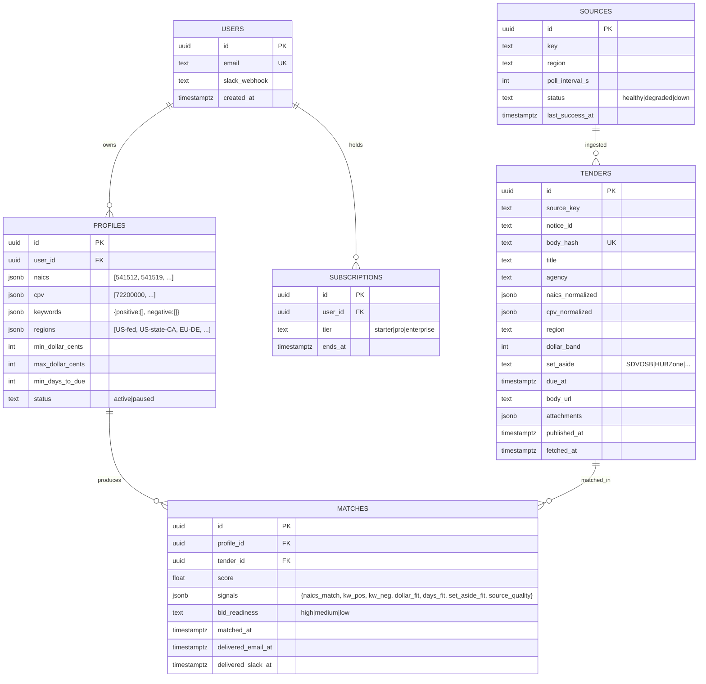

# 12 · Technical specification

> Brassmark = ingestion (80+ registers, 90s poll) + normalization (TenderRecord schema) + scoring
> (NAICS/CPV crosswalk + 7-signal bid-readiness) + notification (email/Slack/webhook). This doc
> is the implementer's contract.

## 1. Architecture overview

```mermaid
flowchart LR
  subgraph Edge[storage-contabo · Traefik]
    Tr[Traefik]
  end
  subgraph Landing[apps/landing · Next.js 15]
    L[Marketing + tier picker]
    CK[/api/checkout/nowpayments]
    WH[/api/webhooks/nowpayments]
  end
  subgraph App[apps/app · Wave 3 Wasp]
    PROFILE[Capture profile setup]
    DASH[Tender ticker]
    OPCONS[Operator console]
  end
  subgraph Ingest[apps/api · Bun + Hono]
    POLL[90s pollers per source]
    DEDUP[Deduper · notice_id + body hash]
    NORM[Normalizer · TenderRecord]
  end
  subgraph Score
    XWALK[NAICS/CPV cross-walk]
    KW[Keyword weighting]
    BR[7-signal bid-readiness]
  end
  subgraph Delivery
    Q[Match queue]
    EM[Email]
    SL[Slack]
    HK[Webhooks]
  end
  subgraph Sources[Procurement registers]
    SAM[SAM.gov]
    STATES[50 US state portals]
    TED[EU TED]
    UK_C[UK Contracts Finder]
    EU8[8 EU member portals]
    OTHER[World Bank · ADB · IDB]
  end
  subgraph Data
    PG[(Postgres)]
    R_CACHE[(Redis · queue + cache)]
    OBJ[(B2 · attachments)]
  end
  subgraph Ext
    NP[NOWPayments]
    PM[Postmark]
    SLK[Slack]
  end
  Sources --> POLL --> DEDUP --> NORM --> Score --> Q
  Q --> EM
  Q --> SL
  Q --> HK
  L --> CK --> NP --> WH
  PROFILE --> PG
```

**Topology.** Single VPS for landing + app; ingest workers per source group (US-fed, US-state,
EU-TED, EU-member, multilateral) on the same host; can scale-out by source group.

## 2. Data model



Indexes: `tenders.body_hash` UNIQUE, `(tenders.source_key, tenders.notice_id)` UNIQUE,
`tenders.due_at`, `(matches.profile_id, matches.tender_id)` UNIQUE.

## 3. API contracts

### Public

| Method | Path | Auth | Request | Response |
|---|---|---|---|---|
| POST | `/api/checkout/nowpayments` | none | `{tier}` | `{invoice_url}` |
| POST | `/api/webhooks/nowpayments` | HMAC-SHA512 | NOWPayments IPN | `{ok:true}` |

### Internal

| Method | Path | Auth | Body |
|---|---|---|---|
| POST | `/api/v1/profiles` | session | `{naics, cpv, keywords, regions, dollar bands}` |
| GET | `/api/v1/matches` | session | `?since=` |
| POST | `/api/v1/profiles/:id/webhook` | session | `{url, secret}` |
| GET | `/api/v1/sources` | session(operator) | — |

### Outbound webhook

`x-brassmark-sig: t=<unix>,v1=<HMAC-SHA256>`. Body includes match + signals + bid_readiness +
links.

## 4. Integrations

| 3rd-party | Auth | Rate | Fallback |
|---|---|---|---|
| SAM.gov API | API key | tier | Mark source degraded |
| EU TED | open data | per-source | Polite headers |
| UK Contracts Finder | API key | tier | Polite headers |
| 50 US state portals | per-portal | varies | Polite headers; mark stale |
| 8 EU member portals | varies | varies | Polite headers |
| World Bank / ADB / IDB | API keys | tier | Polite |
| Slack incoming webhook | URL | 1/sec | Email-only fallback |
| Postmark | server token | 10k/day | Resend |
| NOWPayments | x-api-key + IPN HMAC | 100 RPM | Manual invoice |

## 5. Storage

- Postgres 16. `tenders` partitioned monthly.
- Redis 7 for queue + dedup hot cache.
- B2 for attachment downloads (PDFs, statements of work) with 12-month retention then archive.
- Audit log: every match delivered, every source health change, every subscription change.

## 6. Auth

- Wave 2 anonymous checkout.
- Wave 3 magic-link Wasp auth.
- Operator role flag.
- Outbound webhook HMAC per-profile secret.

## 7. Security

- Secrets in `.env`.
- Rate limits: profile create 10/IP/hr; matches GET 60/min/user.
- IPN HMAC; idempotent.
- PII: emails + Slack URLs; redacted in logs.
- Politeness: per-source headers, robots.txt, conservative rate.

## 8. Observability

- Pino JSON logs → Loki.
- Metrics: `brassmark.source.freshness_s`, `brassmark.match.delivery_ms`, `brassmark.score.distribution`,
  `brassmark.dedup.rate`.
- Alerts: source freshness > 10 min; delivery > 60s p95; webhook 4xx > 5/hr.

## 9. Performance budgets

| Path | p50 | p95 |
|---|---|---|
| Source poll cycle | 60s | 90s |
| Tender → notify | 90s | 180s |
| Profile create | 200ms | 500ms |
| Tender ticker load | 600ms | 1.5s |
| Webhook delivery | 200ms | 1s |

Throughput: 80 sources × 50k tenders/day total.

## 10. Non-goals

- No "bid-writer AI." We score; we do not draft.
- No private RFI scraping behind paywalls (only public registers).
- No daily-only product (real-time is the value).
- No marketing automation (we are intelligence, not outbound).
- No native mobile.
- No translations Wave 2/3 (EN-only).
- No customer-uploaded private RFI data (Wave 4).
